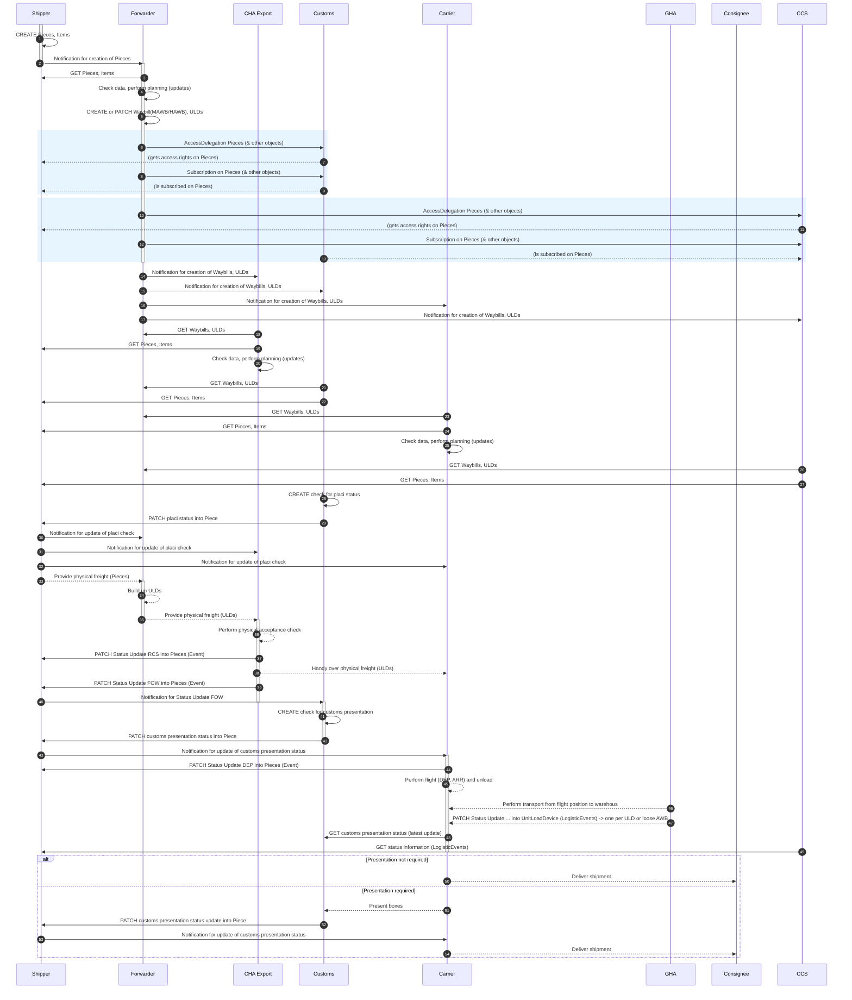

```mermaid
sequenceDiagram

    autonumber

    %% Jede Lifeline repraesentiert den Stakeholder inkl. seines ONE Record Endpoints
    participant Shipper 
    participant Forwarder
    participant CHA Export
    participant Customs
    participant Carrier
    participant GHA
    participant Consignee
    participant CCS

    activate Shipper
    Shipper->>Shipper: CREATE Pieces, Items
    Shipper->>Forwarder: Notification for creation of Pieces
    deactivate Shipper
    activate Forwarder
    Forwarder->>Shipper: GET Pieces, Items
    Forwarder->>Forwarder: Check data, perform planning (updates)
    Forwarder->>Forwarder: CREATE or PATCH Waybill(MAWB/HAWB), ULDs
       rect rgb(230,245,255)
       Forwarder->>Customs: AccessDelegation Pieces (& other objects)
       Customs-->>Shipper: (gets access rights on Pieces)
       Forwarder->>Customs: Subscription on Pieces (& other objects)
       Customs-->>Shipper: (is subscribed on Pieces)
    end
    rect rgb(230,245,255)
       Forwarder->>CCS: AccessDelegation Pieces (& other objects)
       CCS-->>Shipper: (gets access rights on Pieces)
       Forwarder->>CCS: Subscription on Pieces (& other objects)
       Customs-->>CCS: (is subscribed on Pieces)
    end
    deactivate Forwarder
    Forwarder->>CHA Export: Notification for creation of Waybills, ULDs
    Forwarder->>Customs: Notification for creation of Waybills, ULDs
    Forwarder->>Carrier: Notification for creation of Waybills, ULDs
    Forwarder->>CCS: Notification for creation of Waybills, ULDs
    CHA Export->>Forwarder: GET Waybills, ULDs
    CHA Export->>Shipper: GET Pieces, Items
    CHA Export->>CHA Export: Check data, perform planning (updates)
    Customs->>Forwarder: GET Waybills, ULDs
    Customs->>Shipper: GET Pieces, Items
    Carrier->>Forwarder: GET Waybills, ULDs
    Carrier->>Shipper: GET Pieces, Items
    Carrier->>Carrier: Check data, perform planning (updates)
    CCS->>Forwarder: GET Waybills, ULDs
    CCS->>Shipper: GET Pieces, Items
    Customs->>Customs: CREATE check for placi status
    Customs->>Shipper: PATCH placi status into Piece
    Shipper->>Forwarder: Notification for update of placi check
    Shipper->>CHA Export: Notification for update of placi check
    Shipper->>Carrier: Notification for update of placi check

    Shipper-->>Forwarder: Provide physical freight (Pieces)
    activate Forwarder
    Forwarder-->>Forwarder: Build up ULDs
    Forwarder-->>CHA Export: Provide physical freight (ULDs)
    deactivate Forwarder
    activate CHA Export
    CHA Export-->>CHA Export: Perform physical acceptance check
    CHA Export->>Shipper: PATCH Status Update RCS into Pieces (Event)
    CHA Export-->>Carrier: Handy over physical freight (ULDs)
    CHA Export->>Shipper: PATCH Status Update FOW into Pieces (Event)
    Shipper->>Customs: Notification for Status Update FOW
    deactivate CHA Export
    activate Customs
    Customs->>Customs: CREATE check for customs presentation
    Customs->>Shipper: PATCH customs presentation status into Piece
    deactivate Customs
    Shipper->>Carrier: Notification for update of customs presentation status
    activate Carrier
    Carrier->>Shipper: PATCH Status Update DEP into Pieces (Event)
    Carrier-->>Carrier: Perform flight (DEP, ARR) and unload
    GHA-->>Carrier: Perform transport from flight position to warehous
	GHA-->>Carrier: PATCH Status Update ... into UnitLoadDevice (LogisticEvents) -> one per ULD or loose AWB
    Carrier->>Customs: GET customs presentation status (latest update)
    CCS->>Shipper: GET status information (LogisticEvents)
    deactivate Carrier

    %% 6) Zollvorlage & Praesentation
    alt Presentation not required
        Carrier-->>Consignee: Deliver shipment
    else Presentation required
        Carrier-->>Customs: Present boxes 
        Customs->>Shipper: PATCH customs presentation status update into Piece
        Shipper->>Carrier: Notification for update of customs presentation status
        Carrier-->>Consignee: Deliver shipment
    end
```
