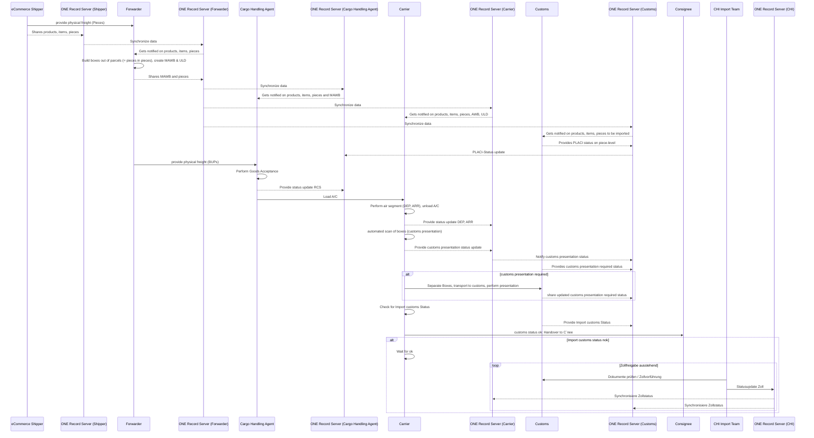

```mermaid
sequenceDiagram
    %% Teilnehmer
    participant eCommerce Shipper
    participant ONE Record Server (Shipper)
    participant Forwarder
    participant ONE Record Server (Forwarder)
    participant Cargo Handling Agent
    participant ONE Record Server (Cargo Handling Agent)
    participant Carrier
    participant ONE Record Server (Carrier)
    participant Customs
    participant ONE Record Server (Customs)
    participant Consignee
    participant CHI Import Team
    participant ONE Record Server (CHI)

    %% Originalprozess von Philipp
    eCommerce Shipper->>Forwarder: provide physical freight (Pieces)
    eCommerce Shipper-->>ONE Record Server (Shipper): Shares products, items, pieces
    ONE Record Server (Shipper)-->>ONE Record Server (Forwarder): Synchronize data
    ONE Record Server (Forwarder)-->>Forwarder: Gets notified on products, items, pieces
    Forwarder->>Forwarder: Build boxes out of parcels (= pieces in pieces), create MAWB & ULD
    Forwarder-->>ONE Record Server (Forwarder): Shares MAWB and pieces
    ONE Record Server (Forwarder)-->>ONE Record Server (Cargo Handling Agent): Synchronize data
    ONE Record Server (Cargo Handling Agent)-->>Cargo Handling Agent: Gets notified on products, items, pieces and MAWB
    ONE Record Server (Forwarder)-->>ONE Record Server (Carrier): Synchronize data
    ONE Record Server (Carrier)-->>Carrier: Gets notified on products, items, pieces, AWB, ULD
    ONE Record Server (Forwarder)-->>ONE Record Server (Customs): Synchronize data
    ONE Record Server (Customs)-->>Customs: Gets notified on products, items, pieces to be imported
    Customs-->>ONE Record Server (Customs): Provides PLACI status on piece-level
    ONE Record Server (Customs)-->>ONE Record Server (Cargo Handling Agent): PLACI-Status update
    Forwarder->>Cargo Handling Agent: provide physical freight (BUPs)
    Cargo Handling Agent->>Cargo Handling Agent: Perform Goods Acceptance
    Cargo Handling Agent-->>ONE Record Server (Cargo Handling Agent): Provide status update RCS
    Cargo Handling Agent->>Carrier: Load A/C
    Carrier->>Carrier: Perform air segment (DEP, ARR), unload A/C
    Carrier-->>ONE Record Server (Carrier): Provide status update DEP, ARR
    Carrier->>Carrier: automated scan of boxes (customs presentation)
    Carrier-->>ONE Record Server (Carrier): Provide customs presentation status update
    ONE Record Server (Carrier)-->>ONE Record Server (Customs): Notify customs presentation status
    Customs-->>ONE Record Server (Customs): Provides customs presentation required status
    alt customs presentation required
        Carrier->>Customs: Separate Boxes, transport to customs, perform presentation
        Customs-->>ONE Record Server (Customs): share updated customs presentation required status
    end
    Carrier->>Carrier: Check for Import customs Status
    Customs-->>ONE Record Server (Customs): Provide Import customs Status
    Carrier->>Consignee: customs status ok: Handover to C´nee

    %% Erweiterung für CHI
    alt Import customs status nok
        Carrier->>Carrier: Wait for ok
        loop Zollfreigabe ausstehend
            CHI Import Team->>Customs: Dokumente prüfen / Zollvorführung
            CHI Import Team->>ONE Record Server (CHI): Statusupdate Zoll
            ONE Record Server (CHI)-->>ONE Record Server (Carrier): Synchronisiere Zollstatus
            ONE Record Server (CHI)-->>ONE Record Server (Customs): Synchronisiere Zollstatus
        end
    end
```
