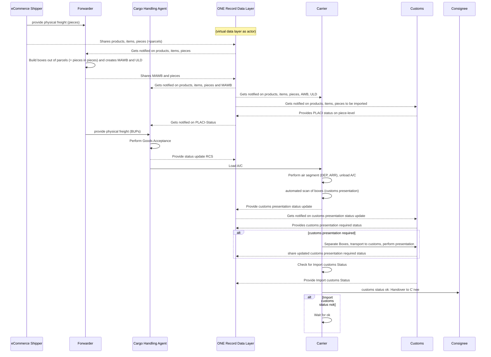

<!--
---
title: good-practice-eCommerce
repository: https://github.com/digital-cargo/good-practice-eCommerce
version: 0.0.1
maintainers: 
- Philipp Billion
ontologies:
- https://onerecord.iata.org/ns/cargo/3.0.0
- https://onerecord.iata.org/ns/api/2.0.0
- https://onerecord.iata.org/ns/coreCodeLists/0.0.3
data-classes:
- https://onerecord.iata.org/ns/cargo#Waybill
- https://onerecord.iata.org/ns/cargo#Shipment
- https://onerecord.iata.org/ns/cargo#Piece
- https://onerecord.iata.org/ns/cargo#TransportMovement
- https://onerecord.iata.org/ns/cargo#Organization
- https://onerecord.iata.org/ns/cargo#LogisticsEvents
- https://onerecord.iata.org/ns/cargo#Location
- https://onerecord.iata.org/ns/cargo#Company
- https://onerecord.iata.org/ns/cargo#Carrier
- https://onerecord.iata.org/ns/cargo#Value
- https://onerecord.iata.org/ns/cargo#Loading
data-properties:
- https://onerecord.iata.org/ns/cargo#actions
- https://onerecord.iata.org/ns/cargo#arrivalLocation
- https://onerecord.iata.org/ns/cargo#departureLocation
- https://onerecord.iata.org/ns/cargo#involvedInActions
- https://onerecord.iata.org/ns/cargo#shipment
- https://onerecord.iata.org/ns/cargo#partofShipment
- https://onerecord.iata.org/ns/cargo#transportIdentifier
- https://onerecord.iata.org/ns/cargo#loadedPieces
- https://onerecord.iata.org/ns/cargo#servedActivity
- https://onerecord.iata.org/ns/cargo#events
- https://onerecord.iata.org/ns/cargo#pieces
- https://onerecord.iata.org/ns/cargo#waybillNumber
- https://onerecord.iata.org/ns/cargo#waybillType
api-version:
- 2.0.0
api-endpoints:
- method: GET 
  path: /logistics-objects/{logisticsObjectId} 
- method: GET 
  path: /logistics-objects/{logisticsObjectId}
- method: GET 
  path: /logistics-objects/{logisticsObjectId}/logistics-events
- method: GET 
  path: /logistics-objects/{logisticsObjectId}/logistics-events/{logisticsEventId}
- method: POST 
  path: /notifications
- method: GET 
  path: /subscriptions
- method: POST 
  path: /subscriptions
- method: GET 
  path: /action-requests/{actionRequestId} 
- method: DELETE
  path: /action-requests/{actionRequestId}
---
-->

# Good Practice: eCommerce
[](https://digital-cargo.org)
[]([https://digital-cargo.org](https://bmdv.bund.de/DE/Home/home.html))
[](https://creativecommons.org/licenses/by/4.0/)
[](https://github.com/digital-cargo/good-practice-eCommerce/releases)

This repository contains the good practice to implement data exchange in the context of eCommerce air cargo based on the ONE Record standard.

## Abstract

ECommerce is a constantly growing commodity with unprecidented challengedes to both, the physical handling and the data management to ensure compliance, safety and efficiency. But the logistics and cargo industry grapples with a prevalent and pressing issue: there is no standard to share eCommerce data sharing throughout the supply chain. The consequence of this lack of standardization is evident: stakeholders are burdened with the expensive and time-consuming task of individualized integrations, harmonization of incompatible data formats from different sources, leading to compliance issues, inefficiencies, misunderstandings, and subsequent maintenance costs. The ONE record standard remedies this situation. This good practice document describes a sequence of required steps to share eCommerce data via ONE Record. 

Based on the ONE Record API version 2.x.x and the ONE Record Data Model version 3.x,x, this document provides guidance on how to share eCommerce data in an easy-to-use and standardized manner.

This good practice is an outcome of the collaboration of major stakeholders within the German "Digital Testbed Air Cargo"-Consortium, sponsored by the German Federal Ministry for Digital and Transport. Lufthansa Cargo and Fraunhofer IML were in the lead.

## Introduction

DTAC intro

In the dynamic world of logistics and cargo, eCommerce shipments set new challenges for both, the physical handling of goods and the sharing and management of data. Yet, as businesses expand and systems diversify, the industry faces a challenge: the myriad of non-standardized tracking systems, each requiring unique integration and understanding. This fragmentation not only complicates operations but also escalates costs and reduces efficiency.

Initiated and moderated by the International Air Transportation Association (IATA), ONE Record aims to be the standard to enable and simplify data sharing in  transportation industry. By leveraging the ONE Record standard, stakeholders can draw on a unified data model and API that promotes seamless integration across various platforms and improves collaboration between various organizations. 
This standardization comes with a number of benefits, from reducing the complexity and cost of custom integrations to enhancing transparency and trust.
It lays the foundation for standardization, enabling a consistent data model and API across diverse platforms, thereby streamlining integrations and collaborations.
This uniformity heightens transparency, allowing stakeholders to effortlessly interpret shipment data, fostering trust throughout the supply chain.
Moreover, the standardized approach curtails complexities tied to integration, conserving both time and resources that might otherwise be diverted to bespoke solutions. 

The purpose of this document is to explain how eCommerce data can be shared most efficiently by using ONE Record. Among other things, the goal is to highlight ONE Record's unique value proposition and motivate technical and business audiences to move to this standardized approach.

### Scope

This good practice details the application of the ONE Record standard specifically in the context of shipment tracking. 
By using this good practice, organizations can understand, adopt, and streamline their shipment tracking offering to global best practice.

**What this document covers:**

- **Business context**: Assumptions, prerequisites, and the broader business scenario where this good practice is applicable.
- **Technical examples**: Detailed descriptions and examples of the API calls, data model classes, data mappings, and their applications in the context of shipment tracking.
- **Transition recommendations**: Recommendations and guidelines that businesses should consider for a smooth and effective transition to ONE Record.

**What this document does not cover:**

- **Compelete implementations**: This good practice includes sample code to support knowledge transfer, it does not provide detailed implementation or out-of-the-box software.
- **Comparison with other standards**: This good practice describes the implementation with the ONE Record Standard. A comparison with other standards in the industry is not covered.
- **Vendor-specific implementations**: This document focuses on the standard itself and does not address specific third-party tools or solutions.
- **Complete technical specifications**: This document focuses solely on the ONE Record aspects pertinent to eCommerce data sharing and doesn't encompass the entire technical breadth of the standard.

This guide is based on the published ONE Record specifications prevalent as of `xxxx-xx-xx`. 
As the industry evolves, it is imperative for stakeholders to keep up to date on subsequent versions or changes to the standard.

The interpretations is following 


**Target audience**

This document is intended for anyone interested in this topic. This can range from logistics professionals, supply chain managers, software developers, and other stakeholders involved in shipment tracking and data exchange within the logistics and cargo industry. It is designed to cater to both technical and business-oriented individuals interested in adopting standardized practices for efficient eCommerce data sharing.

**General definitions within eCommerce data sharing**

A `shipment` is defined as pieces under one contract and is not limited to the Air Waybill (AWB), which is used particularly in air freight. Since ONE Record aims at multimodality, this good practice should also be applicable to transport modes other than air transport.

A `piece` refers to an individual item or unit of cargo that is part of a larger shipment. It could be a single package, container, pallet, or any other distinct physical unit.

An `item`....

A `parcel`....

`GHA`: Ground Handling Agent

**Geographical coverage**

This eCommerce data sharing best practice is globally applicable, unhindered by regional or national distinctions. 
With no legal or operational barriers to its adoption, the outlined solution is primed for worldwide deployment. 
As a result, companies of any size, at any location, can take advantage of the standardized workflows and increased efficiencies created by ONE Record.

### Variants

This section explores different scenarios within the context of the ONE Record Standard, delineating various approaches to data exchange in the realm of eCommerce data sharing. These scenarios encompass diverse arrangements of data sharing and update processes among stakeholders involved in the logistics and cargo industry.
(...)

## Background

### ONE Record Standard

The implementation of shipment tracking as described in this good practice is based entirely on the [ONE Record standard](https://github.com/IATA-Cargo/ONE-Record).

This good practice incorporates data classes of the [ONE Record cargo ontology v3.0.0](https://onerecord.iata.org/ns/cargo)
and the [ONE Record core code lists ontology v0.0.3](https://onerecord.iata.org/ns/coreCodeLists).

Furthermore, it utilises the [ONE Record API specificaiton v2.0.0](https://iata-cargo.github.io/ONE-Record/).

### Related Good Practices

The [ShipmentTracking](https://github.com/digital-cargo/good-practice-shipment-tracking) use case is closely related to the [ShipmentRecord](https://github.com/digital-cargo/good-practice-shipment-record) use case which is also based on the ONE Record standard. However, the eCommerce Data Sharing use case is focused to the exchange of eCommerce related information with other parties.

### Piece-centricity and physics-orientation

Today in air cargo, tracking information is typically provided at the shipment level, but the ONE Record data model follows the principle of piece-centricity as a core design principle.
Another design principle of ONE Record is its aim to reflect the actual physical world, its objects and activities. 

For example, in ONE Record, it is not a legal object or a paper document such as the Air Waybill (AWB) that marks the progress of a shipment until it reaches a milestone. Instead, it is the actual [Piece](https://onerecord.iata.org/ns/cargo#Piece), the wrapping [Shipment](https://onerecord.iata.org/ns/cargo#Shipment), or a [TransportMovement](https://onerecord.iata.org/ns/cargo#TransportMovement) activity that reaches a milestone in the journey. 
For example, when every piece in a shipment has been loaded and the aircraft departs, we consider the entire shipment as having departed.

### skeletonIndicator

The [skeletonIndicator](https://onerecord.iata.org/ns/cargo#skeletonIndicator) is a specific marker or flag used within data objects in the ONE Record standard. 
The skeletonIndicator signifies that the data object and its properties act as placeholders and do not represent granular, individual data points. Instead, they offer a high-level or "skeletal" representation of the data, primarily for modeling piece-level data.

It enables piece-level modeling of shipment data in a not fully piece-level environment that is in transition, but provides the basis for future developments. 
This can be useful (1) when piece-level granularity is not required, (2) when non-integrable data sets are involved, (3) or when piece-level processing is not yet feasible in physical handling operations.

## Business Process and Data Sharing

### Process overview




#### Remarks
* The role "Carrier" includes the import Cargo Handling Agent role at the carrier hub, which is - in this case - also the import station 
* Full line: physical flow
* Dotted line: information flow
* Notifications (PUB/SUB) are only mentioned when essential for the process; further notification, e.g. for the shipper, providing a significant additional benefit through improved transparency, are not mentioned here.
* The process is designed around the current data types, it does not reflect a data-centric green-field approach 

### Shipper´s process and data

The process starts by the Shipper providing the information on the items to be transported. Theoretically, the process could also be started by an order of the consignee, but the application of this process is unlikely, as the order of the consignee is usually not managed by the TMS.

Today, the following data fields are typically provided on a non-standardized basis, as csv, excel, non-standadized API or in an eMail:

| **Field**                             | **Value**                                      |
|--------------------------------------|------------------------------------------------|
| customer id                          | f147c4d1-a91d-49a3-a00e-74893cc9b7f8           |
| consignee id                         | 113493c5-8b04-4836-b7d8-c2fb54bb78d4           |
| shipping order id                    | d193bb65-61fa-402a-b5cf-71cd02476070           |
| external tracking code               | 63300065206929301280429                        |
| destination airport iata             | MAD                                            |
| amount                               | 22.73                                          |
| currency                             | EUR                                            |
| parcel id                            | HWMMEVJMXX3Y                                   |
| has milk powder                      | FALSE                                          |
| invoice number                       | YE21771201                                     |
| weight in g                          | 650                                              |
| has dangerous goods                  | FALSE                                          |
| width in cm                          | 9                                              |
| height in cm                         | 20                                             |
| length in cm                         | 15                                             |
| final weight in g                | 800                                            |
| dangerous goods regulations type     |                                                |
| postal code                          | 28042                                          |
| region                               |                                                |
| country                              | ES                                             |
| special handling codes               | BUP,CSL,EAW,ECC,GEN,SLY                        |
| article_sku                          | YEP_MT_01_002                                  |
| article_name                         | ALARM CLOCKS                                |
| article\_price\_amount               | 2273 |
| article\_price\_currency               | EUR |
| article_hsCode                       | 7754859                                        |
| article_quantity                     | 1                                              |
| article_articleId                    | d193bb65-61fa-402a-b5cf-71cd02476070-0         |
| article_weightInGrams               | 650                                              |
| article_countryOfOrigin             | KR                                             |

As some data is redundant (e.g. amount, currency and article\_price\_amount and article\_price\_currency), the more populated and more accurate data field was chosen (here: amount, currency).

From a conceptual side, this data is to be distributed amongst the ONE Record Logistics Objects product (i.e. iPhone 16 pro), item (a single iPhone 16 pro), and piece (15 iPhones in one Box). 

**Basic Logistic objects (places, organizations)**

tbd


**Product**

The product in ONE Record is supposed to provide the following information:
  - uniqueIdentfier
  - description
  - hsCode

In our data example, only the following data fields exist: 

|**ONE Record Logistics Object** | **Field**                              | **Value**                                      |
|---------------------------------------|---------------------------------------|------------------------------------------------|
| description | article_name                          | ALARM CLOCKS                                 |
| hsCode | article_hsCode                        | 7754859                                     |
| uniqueIdentifier | article_articleId                     | d193bb65-61fa-402a-b5cf-71cd02476070-0          |


As the current data structure doesn´t provide sufficient information for generating proper products, we will generate one product per item.  

```json
{
    "@context": {
        "@vocab": "https://onerecord.iata.org/ns/cargo#"
    },
    "@type": "product",
    "@id": "https://1r.example.com/logistics-objects/product-8cdf33e4-7629-483f-a4dd-e16c05c1630e-0",
    "hsCode": "973348",
    "description": "SWEATERS knitted",
    "describedObjects": [
    {
		 "@id": "http://{shipperDomain}/logistics-objects/item-effd84fa-60e5-4729-8b25-816423f9a715-0"
    }
}
```

Remarks:

- The id does not need to follow standardization, it must only be unique on the server. Here, the following schema was used: LO-Type - uniqueID for better transparency (e.g. "https://1r.example.com/logistics-objects/product-8cdf33e4-7629-483f-a4dd-e16c05c1630e-0").
- describedObjects contains the links to the linked items.


**Item**

Within this example, the item will provide the following information:
  - price: currency, amount
  - different IDs: articleID, customerID, consigneeID, shipping order ID, parcelID, invoiceNumber, external tracking code
  - dangerous goods indicator
  - weight / measured weight per item 
  - dimensions of item
  - country of consignee
  - country of production

In our data example, only the following data fields exist: 

| **ONE Record Logistics Object** | **Field**                 | **Value**                                    |
|----------------------------------|----------------------------|-----------------------------------------------|
| otherIdentifier                  | customer id               | f147c4d1-a91d-49a3-a00e-74893cc9b7f8          |
| otherIdentifier                  | consignee id              | 113493c5-8b04-4836-b7d8-c2fb54bb78d4          |
| otherIdentifier                  | shipping order id         | d193bb65-61fa-402a-b5cf-71cd02476070          |
| otherIdentifier                  | external tracking code    | 63300065206929301280429                       |
| numericValue                     | amount                    | 22.73                                         |
| currencyUnit                     | currency                  | EUR                                           |
| otherIdentifier                  | parcel id                 | HWMMEVJMXX3Y                                  |
| otherIdentifier                  | invoice number            | YE21771201                                    |
| grossWeight                      | weight in g               | 650                                           |
| dimensions                       | width in cm               | 9                                             |
| dimensions                       | height in cm              | 20                                            |
| dimensions                       | length in cm              | 15                                            |
| targetCountry                    | country                   | ES                                            |
| otherIdentifier                  | article_sku               | YEP_MT_01_002                                 |
| otherIdentifier                  | article_articleId         | d193bb65-61fa-402a-b5cf-71cd02476070-0        |
| productionCountry                | article_countryOfOrigin   | KR                                            |


As the current data structure doesn´t provide sufficient information for generating proper products, we will generate one product per item.  

```json
{
  "@context": {
    "@vocab": "https://onerecord.iata.org/ns/cargo#",
    "coreCodeLists": "https://onerecord.iata.org/ns/coreCodeLists#",
    "xsd": "http://www.w3.org/2001/XMLSchema#"
  },
  "@type": "Item",
  "@id": "https://1r.example.com/logistics-objects/item-d193bb65-61fa-402a-b5cf-71cd02476070-0",
  "ofProduct": [
    {
      "@id": "http://{shipperDomain}/logistics-objects/product-d193bb65-61fa-402a-b5cf-71cd02476070-0"
    }
  ],
  "grossWeight": {
    "@type": "Value",
    "value": {
      "@value": "0.65",
      "@type": "xsd:double"
    },
    "unit": {
      "@id": "coreCodeLists:MeasurementUnitCode_KGM"
    }
  },
  "unitPrice": {
    "@type": "Value",
    "value": {
      "@value": "22.73",
      "@type": "xsd:double"
    },
    "unit": {
      "@id": "coreCodeLists:CurrencyCode_EUR"
    }
  },
  "dimensions": {
    "width": {
      "@type": "Value",
      "value": {
        "@value": "15",
        "@type": "xsd:double"
      },
      "unit": {
        "@id": "coreCodeLists:MeasurementUnitCode_CMT"
      }
    },
    "height": {
      "@type": "Value",
      "value": {
        "@value": "20",
        "@type": "xsd:double"
      },
      "unit": {
        "@id": "coreCodeLists:MeasurementUnitCode_CMT"
      }
    },
    "length": {
      "@type": "Value",
      "value": {
        "@value": "9",
        "@type": "xsd:double"
      },
      "unit": {
        "@id": "coreCodeLists:MeasurementUnitCode_CMT"
      }
    }
  },
  "productionCountry": {
    "@type": "CodeListElement",
    "code": "DE",
    "codeListName": "UN/LOCODE",
    "codeListReference": "https://unece.org/trade/cefact/unlocode-code-list-country-and-territory",
    "codeListVersion": "223-1"
  },
  "targetCountry": {
    "@type": "CodeListElement",
    "code": "ES",
    "codeListName": "UN/LOCODE",
    "codeListReference": "https://unece.org/trade/cefact/unlocode-code-list-country-and-territory",
    "codeListVersion": "223-1"
  },
  "otherIdentifiers": [
    {
      "otherIdentifierType": "customer id",
      "textualValue": "f147c4d1-a91d-49a3-a00e-74893cc9b7f8"
    },
    {
      "otherIdentifierType": "consignee id",
      "textualValue": "113493c5-8b04-4836-b7d8-c2fb54bb78d4"
    },
    {
      "otherIdentifierType": "shipper order id",
      "textualValue": "d193bb65-61fa-402a-b5cf-71cd02476070"
    },
    {
      "otherIdentifierType": "external tracking code",
      "textualValue": "63300065206929301280429"
    },
    {
      "otherIdentifierType": "article_articleId",
      "textualValue": "d193bb65-61fa-402a-b5cf-71cd02476070-0"
    }
  ]
}
```


Remarks:

- As article_quantity is alway "1", there´s no need to create more instances of the same object.
- The data field ofProduct contains the link to the product, inPiece the link to the physical piece the item is included in.
- As the WeightUnit is either KGM, LBR, or ONZ in ONE Record, we have to convert the weight into KGM.

**Pieces**

The highest Level of physical consolidation are the parcels, that contain one or more items. In the ONE Record data model, they are pieces. 

| **ONE Record Logistics Object** | **Field**               | **Value**                          |
|----------------------------------|-------------------------|------------------------------------|
| otherIdentifiers                 | parcel id               | HWMMEVJMXX3Y                       |
| specialHandlingCode              | special handling codes  | BUP,CSL,EAW,ECC,GEN,SLY            |

```json
{
    "@context": {
        "@vocab": "https://onerecord.iata.org/ns/cargo#"
    },
    "@type": "piece",
    "@id": "https://1r.example.com/logistics-objects/piece-HWMMEVJMXX3Y",
    "specialHandlingCode": {
    	"@type": "CodeListElement",
    	"code": "BUP",
  	  	"code": "CSL",
    	"code": "EAW",
    	"code": "ECC",
    	"code": "GEN",
    	"code": "SLY",
    	"codeListReference": "https://onerecord.iata.org/ns/coreCodeLists/index-en.html#SpecialHandlingCode",
  	},
    "containedItems": [
    {
		 "@id": "http://{shipperDomain}/logistics-objects/item-effd84fa-60e5-4729-8b25-816423f9a715-0"
    },
    "otherIdentifiers": [
    {
      "otherIdentifierType": "parcel ID",
      "textualValue": "HWMMEVJMXX3Y"
    }
  ]
}
```


### Forwarder´s process and data

The Forwarder create pieces on two levels

1 MAWB per ULD


## Special Cases:

## Guidelines for implementation

## Glossary
see [digita-cargo/glossary](https://github.com/IATA-Cargo/ONE-Record/blob/fc8527959754a69a00fcc36d97a0c446618f435f/working_draft/API/docs/glossary.md)

## References

- ...
- ...
- ...
  
## Acknowledgements

The initial version of this document is the outcome of the  "Joint ONE Record piloting and transition working group // technical part" at IATA. 
It was orchestrated by Arnaud Lambert of IATA as secretary and [Philipp Billion](https://github.com/DrPhilippBillion) of Lufthansa Cargo as chairman.

Special thanks to [Niclas Scheiber](https://github.com/NiclasScheiber), Frankfurt University of Applied Sciences for preparing version 3.0.0 of the 
ONE Record core ontology in coordination with the IATA ONE Record data model focus group.

## Community

### Contribute

See [CONTRIBUTING](CONTRIBUTING.md) for more details on how to contribute on this good practice.

### Issues
Issues related to this good practice are tracked on GitHub

- [View open issues](https://github.com/digital-cargo/good-practice-shipment-tracking/issues)
- [Create a new issue](https://github.com/digital-cargo/good-practice-shipment-tracking/issues/new)

### Maintainers

> Each good practice MUST have at least one maintainer who is responsible for ongoing development and quality assurance. 
> Every maintainer MUST have commit access to the good practice repository.

- [Daniel A. Döppner](https://github.com/ddoeppner), Lufthansa Cargo 
- [Ingo Zeschky](https://github.com/ChrisKranich), Lufthansa Cargo
- [Philipp Billion](https://github.com/DrPhilippBillion), Lufthansa Cargo

_(sorted alphabetically)_

### Contributors

> Every good practice is the result of the work of the community, and therefore the contribution of each individual should be recognized and appreciated. 
> Below is a list of all the people who have actively contributed to this good practice.

- Arnaud Lambert, IATA

_(sorted alphabetically)_


