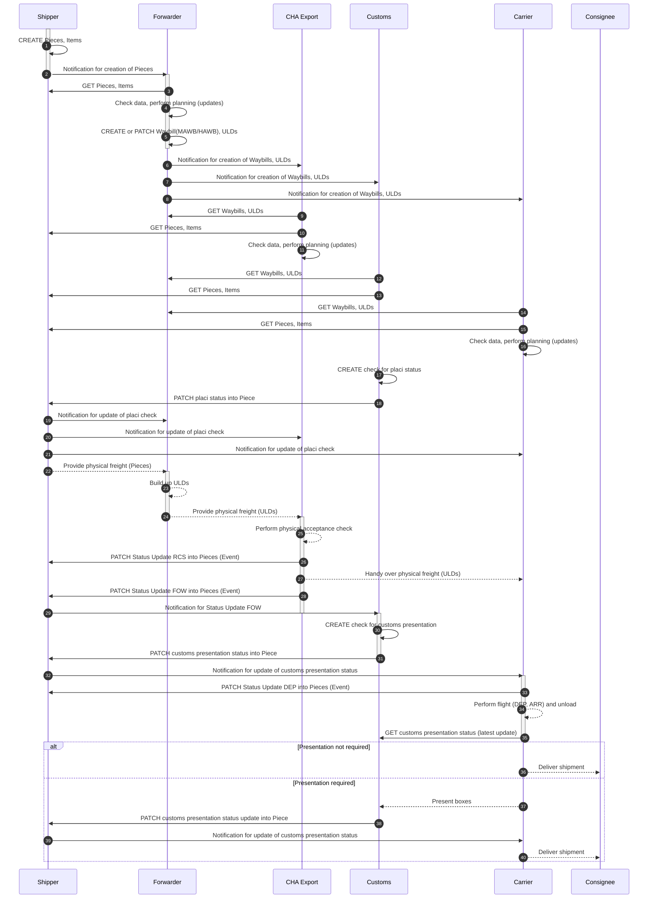

<!--
---
title: good-practice-eCommerce
repository: https://github.com/digital-cargo/good-practice-eCommerce
version: 0.0.1
maintainers: 
- Philipp Billion
ontologies:
- https://onerecord.iata.org/ns/cargo/3.0.0
- https://onerecord.iata.org/ns/api/2.0.0
- https://onerecord.iata.org/ns/coreCodeLists/0.0.3
data-classes:
- https://onerecord.iata.org/ns/cargo#Waybill
- https://onerecord.iata.org/ns/cargo#Shipment
- https://onerecord.iata.org/ns/cargo#Piece
- https://onerecord.iata.org/ns/cargo#TransportMovement
- https://onerecord.iata.org/ns/cargo#Organization
- https://onerecord.iata.org/ns/cargo#LogisticsEvents
- https://onerecord.iata.org/ns/cargo#Location
- https://onerecord.iata.org/ns/cargo#Company
- https://onerecord.iata.org/ns/cargo#Carrier
- https://onerecord.iata.org/ns/cargo#Value
- https://onerecord.iata.org/ns/cargo#Loading
data-properties:
- https://onerecord.iata.org/ns/cargo#actions
- https://onerecord.iata.org/ns/cargo#arrivalLocation
- https://onerecord.iata.org/ns/cargo#departureLocation
- https://onerecord.iata.org/ns/cargo#involvedInActions
- https://onerecord.iata.org/ns/cargo#shipment
- https://onerecord.iata.org/ns/cargo#partofShipment
- https://onerecord.iata.org/ns/cargo#transportIdentifier
- https://onerecord.iata.org/ns/cargo#loadedPieces
- https://onerecord.iata.org/ns/cargo#servedActivity
- https://onerecord.iata.org/ns/cargo#events
- https://onerecord.iata.org/ns/cargo#pieces
- https://onerecord.iata.org/ns/cargo#waybillNumber
- https://onerecord.iata.org/ns/cargo#waybillType
api-version:
- 2.0.0
api-endpoints:
- method: GET 
  path: /logistics-objects/{logisticsObjectId} 
- method: GET 
  path: /logistics-objects/{logisticsObjectId}
- method: GET 
  path: /logistics-objects/{logisticsObjectId}/logistics-events
- method: GET 
  path: /logistics-objects/{logisticsObjectId}/logistics-events/{logisticsEventId}
- method: POST 
  path: /notifications
- method: GET 
  path: /subscriptions
- method: POST 
  path: /subscriptions
- method: GET 
  path: /action-requests/{actionRequestId} 
- method: DELETE
  path: /action-requests/{actionRequestId}
---
-->

# Good Practice: eCommerce
[](https://digital-cargo.org)

[](https://creativecommons.org/licenses/by/4.0/)
[](https://github.com/digital-cargo/good-practice-eCommerce/releases)

This repository contains the good practice to implement data exchange in the context of eCommerce air cargo based on the ONE Record standard.

## DELME: STATUS / Open Issues

- PUB/SUB examples // Standardize wording "triggered by PUB/SUB?" by "publication?"
- Replace placeholders for servers
- Add Access Delegation in Sequence Diagram
- RFID to be extracted: potential for other application when 1R URI written into Tag 
- Use of Milestones for customs statuses (=> Diskussion mit Niclas)
- CHECK Name: Change to Standard, not clear yet
- Cascading PUB/SUB? Reicht es, auf das Piece subscribed zu sein, um über das Customs CheckLO notifiziert zu werden, wenn Customs einen Backlink fordert


## DELME: Status

| **Step**                         | **Implementing party** | **AP1.2: Process Description** | **AP1.2: Sequence Diagram** | **AP1.2: LO Description** | **AP1.2: API Feature application** | **AP1.3: Postman Collection, Test-Execution, etc** | 
|----------------------------------|------------------------|-------------------------|----------------------|--------------------|---------------------|------------------------|
| **eCom Shipper: Data provision** | CHI                    | 90%                     | 90%                  | nok                | nok                 | nok                    |
| **Customs: PLACI**               | LH Cargo               | 95%                     | 90%                  | 100%                | nok                 | nok                    |
| **Forwarder: BU**                | Schenker               | nok                     | 90%                  | nok                | nok                 | nok                    |
| **Forwarder: RFID part**         | LH Cargo               | SEPARATED               | SEPARATED            | SEPARATED          | SEPARATED           | SEPARATED              |
| **Carrier: core transport**      | LH Cargo               | 95%                     | 95%                  | 95%                | 20%                 | nok                    |
| **Customs: presentation status** | LH Cargo               | 50%                     | 50%                  | 80%                | 50%                 | nok                    |
| **GHA Import**                   | CHI                    | 90%                     | 90%                  | nok                | nok                 | nok                    |


## Abstract

ECommerce is a constantly growing commodity with unprecidented challengedes to both, the physical handling and the data management to ensure compliance, safety and efficiency. But the logistics and cargo industry grapples with a prevalent and pressing issue: there is no standard to share eCommerce data sharing throughout the supply chain. The consequence of this lack of standardization is evident: stakeholders are burdened with the expensive and time-consuming task of individualized integrations, harmonization of incompatible data formats from different sources, leading to compliance issues, inefficiencies, misunderstandings, and subsequent maintenance costs. The ONE record standard remedies this situation. This good practice document describes a sequence of required steps to share eCommerce data via ONE Record. 

Based on the ONE Record API version 2.x.x and the ONE Record Data Model version 3.x,x, this document provides guidance on how to share eCommerce data in an easy-to-use and standardized manner.

This good practice is an outcome of the collaboration of major stakeholders within the German "Digital Testbed Air Cargo"-Consortium, sponsored by the German Federal Ministry for Digital Transformation and Government Modernisation. Lufthansa Cargo and Fraunhofer IML were in the lead.

## Introduction

DTAC intro

In the dynamic world of logistics and cargo, eCommerce shipments set new challenges for both, the physical handling of goods and the sharing and management of data. Yet, as businesses expand and systems diversify, the industry faces a challenge: the myriad of non-standardized tracking systems, each requiring unique integration and understanding. This fragmentation not only complicates operations but also escalates costs and reduces efficiency.

Initiated and moderated by the International Air Transportation Association (IATA), ONE Record aims to be the standard to enable and simplify data sharing in  transportation industry. By leveraging the ONE Record standard, stakeholders can draw on a unified data model and API that promotes seamless integration across various platforms and improves collaboration between various organizations. 
This standardization comes with a number of benefits, from reducing the complexity and cost of custom integrations to enhancing transparency and trust.
It lays the foundation for standardization, enabling a consistent data model and API across diverse platforms, thereby streamlining integrations and collaborations.
This uniformity heightens transparency, allowing stakeholders to effortlessly interpret shipment data, fostering trust throughout the supply chain.
Moreover, the standardized approach curtails complexities tied to integration, conserving both time and resources that might otherwise be diverted to bespoke solutions. 

The purpose of this document is to explain how eCommerce data can be shared most efficiently by using ONE Record. Among other things, the goal is to highlight ONE Record's unique value proposition and motivate technical and business audiences to move to this standardized approach.

### Scope

This good practice details the application of the ONE Record standard specifically in the context of eCommerce data sharing. By using this good practice, organizations can understand, adopt, and streamline their eCommerce offering to global best practice.

**What this document covers:**

- **Business context**: Assumptions, prerequisites, and the broader business scenario where this good practice is applicable.
- **Technical examples**: Detailed descriptions and examples of the API calls, data model classes, data mappings, and their applications in the context of eCommerce.
- **Transition recommendations**: Recommendations and guidelines that businesses should consider for a smooth and effective transition to ONE Record.

**What this document does not cover:**

- **Compelete implementations**: This good practice includes sample code to support knowledge transfer, it does not provide detailed implementation or out-of-the-box software.
- **Comparison with other standards**: This good practice describes the implementation with the ONE Record Standard. A comparison with other standards in the industry is not covered.
- **Vendor-specific implementations**: This document focuses on the standard itself and does not address specific third-party tools or solutions.
- **Complete technical specifications**: This document focuses solely on the ONE Record aspects pertinent to eCommerce data sharing and doesn't encompass the entire technical breadth of the standard.

This guide is based on the published ONE Record specifications prevalent as of `xxxx-xx-xx`. 
As the industry evolves, it is imperative for stakeholders to keep up to date on subsequent versions or changes to the standard.

**Target audience**

This document is intended for anyone interested in this topic. This can range from logistics professionals, supply chain managers, software developers, and other stakeholders involved in shipment tracking and data exchange within the logistics and cargo industry. It is designed to cater to both technical and business-oriented individuals interested in adopting standardized practices for efficient eCommerce data sharing.

**General definitions within eCommerce data sharing**

A `shipment` is defined as pieces under one contract and is not limited to the Air Waybill (AWB), which is used particularly in air freight. Since ONE Record aims at multimodality, this good practice should also be applicable to transport modes other than air transport.

A `piece` refers to an individual item or unit of cargo that is part of a larger shipment. It could be a single package, container, pallet, or any other distinct physical unit.

An `item`....

A `parcel`....

`CHA`: Ground Handling Agent

**Geographical coverage**

This eCommerce data sharing best practice is globally applicable, unhindered by regional or national distinctions. With no legal or operational barriers to its adoption, the outlined solution is primed for worldwide deployment. As a result, companies of any size, at any location, can take advantage of the standardized workflows and increased efficiencies created by ONE Record.

### Variants

This section explores different scenarios within the context of the ONE Record Standard, delineating various approaches to data exchange in the realm of eCommerce data sharing. These scenarios encompass diverse arrangements of data sharing and update processes among stakeholders involved in the logistics and cargo industry.
(...)

## Background

### ONE Record Standard

This good practice incorporates data classes of the [ONE Record cargo ontology v3.0.0](https://onerecord.iata.org/ns/cargo) and the [ONE Record core code lists ontology v0.0.3](https://onerecord.iata.org/ns/coreCodeLists). Furthermore, it utilises the [ONE Record API specificaiton v2.0.0](https://iata-cargo.github.io/ONE-Record/).

### Related Good Practices

The [ShipmentTracking](https://github.com/digital-cargo/good-practice-shipment-tracking) use case is related. However, the eCommerce Data Sharing use case is focused to the exchange of eCommerce related information with other parties.

### Piece-centricity and physics-orientation

Today in air cargo, tracking information is typically provided at the shipment level, but the ONE Record data model follows the principle of piece-centricity as a core design principle.Another design principle of ONE Record is its aim to reflect the actual physical world, its objects and activities. Both principles find perfect application at the eCommerce use case. 


## Business Process and Data Sharing

### Business Process overview

Remark: For the business interaction, all ONE Record data sharing is displayed as a separte swimlane. This is not to be interpreted as a single server or storage. It includes all de-central ONE Record servers by the different stakeholders. 



#### Remarks
* The traditional Customs Declaration process is not integrated here - as it doesn´t differ from the conventional customs declaration process
* The role "Carrier" includes the import Cargo Handling Agent role at the carrier hub, which is - usually and in this case - also the import station
* Logististics Objects are always mentioned in plural if it is likely that more than one object is used; still most objects, like ULD can have occure as single or multiple physical entities
* Updates / corrections are always possible within the process, but not explicitly mentioned here. Any stakeholder can set a Change- / Clarification request at any time, and the data owner can react accordingly; in case of changes to data, all subscribed stakeholders would get notified and could react according to their processes
* Full line: information flow; dotted line: physical flow
* Notifications (PUB/SUB) are only mentioned when essential for the process; further notification, e.g. for the shipper, providing a significant additional benefit through improved transparency, are not mentioned here.


#### Remarks
* The role "Carrier" includes the import Cargo Handling Agent role at the carrier hub, which is - in this case - also the import station 
* Full line: physical flow
* Dotted line: information flow
* Notifications (PUB/SUB) are only mentioned when essential for the process; further notification, e.g. for the shipper, providing a significant additional benefit through improved transparency, are not mentioned here.
* The process is designed around the current data types, it does not reflect a data-centric green-field approach 

### Shipper´s process and data

The process starts by the Shipper providing the information on the items to be transported. Theoretically, the process could also be started by an order of the consignee, but the application of this process is unlikely, as the order of the consignee is usually not managed by the TMS.

Today, the following data fields are typically provided on a non-standardized basis, as csv, excel, non-standadized API or in an eMail:

| **Field**                             | **Value**                                      |
|--------------------------------------|------------------------------------------------|
| customer id                          | f147c4d1-a91d-49a3-a00e-74893cc9b7f8           |
| consignee id                         | 113493c5-8b04-4836-b7d8-c2fb54bb78d4           |
| shipping order id                    | d193bb65-61fa-402a-b5cf-71cd02476070           |
| external tracking code               | 63300065206929301280429                        |
| destination airport iata             | MAD                                            |
| amount                               | 22.73                                          |
| currency                             | EUR                                            |
| parcel id                            | HWMMEVJMXX3Y                                   |
| has milk powder                      | FALSE                                          |
| invoice number                       | YE21771201                                     |
| weight in g                          | 650                                              |
| has dangerous goods                  | FALSE                                          |
| width in cm                          | 9                                              |
| height in cm                         | 20                                             |
| length in cm                         | 15                                             |
| final weight in g                | 800                                            |
| dangerous goods regulations type     |                                                |
| postal code                          | 28042                                          |
| region                               |                                                |
| country                              | ES                                             |
| special handling codes               | BUP,CSL,EAW,ECC,GEN,SLY                        |
| article_sku                          | YEP_MT_01_002                                  |
| article_name                         | ALARM CLOCKS                                |
| article\_price\_amount               | 2273 |
| article\_price\_currency               | EUR |
| article_hsCode                       | 7754859                                        |
| article_quantity                     | 1                                              |
| article_articleId                    | d193bb65-61fa-402a-b5cf-71cd02476070-0         |
| article_weightInGrams               | 650                                              |
| article_countryOfOrigin             | KR                                             |

As some data is redundant (e.g. amount, currency and article\_price\_amount and article\_price\_currency), the more populated and more accurate data field was chosen (here: amount, currency).

From a conceptual side, this data is to be distributed amongst the ONE Record Logistics Objects product (i.e. iPhone 16 pro), item (a single iPhone 16 pro), and piece (15 iPhones in one Box). 

**Basic Logistic objects (places, organizations)**

tbd


**Product**

The product in ONE Record is supposed to provide the following information:
  - uniqueIdentfier
  - description
  - hsCode

In our data example, only the following data fields exist: 

|**ONE Record Logistics Object** | **Field**                              | **Value**                                      |
|---------------------------------------|---------------------------------------|------------------------------------------------|
| description | article_name                          | ALARM CLOCKS                                 |
| hsCode | article_hsCode                        | 7754859                                     |
| uniqueIdentifier | article_articleId                     | d193bb65-61fa-402a-b5cf-71cd02476070-0          |


As the current data structure doesn´t provide sufficient information for generating proper products, we will generate one product per item.  

```json
{
    "@context": {
        "@vocab": "https://onerecord.iata.org/ns/cargo#"
    },
    "@type": "product",
    "@id": "https://1r.example.com/logistics-objects/product-8cdf33e4-7629-483f-a4dd-e16c05c1630e-0",
    "hsCode": "973348",
    "description": "SWEATERS knitted",
    "describedObjects": [
    {
		 "@id": "http://{shipperDomain}/logistics-objects/item-effd84fa-60e5-4729-8b25-816423f9a715-0"
    }
}
```

Remarks:

- The id does not need to follow standardization, it must only be unique on the server. Here, the following schema was used: LO-Type - uniqueID for better transparency (e.g. "https://1r.example.com/logistics-objects/product-8cdf33e4-7629-483f-a4dd-e16c05c1630e-0").
- describedObjects contains the links to the linked items.


**Item**

Within this example, the item will provide the following information:
  - price: currency, amount
  - different IDs: articleID, customerID, consigneeID, shipping order ID, parcelID, invoiceNumber, external tracking code
  - dangerous goods indicator
  - weight / measured weight per item 
  - dimensions of item
  - country of consignee
  - country of production

In our data example, only the following data fields exist: 

| **ONE Record Logistics Object** | **Field**                 | **Value**                                    |
|----------------------------------|----------------------------|-----------------------------------------------|
| otherIdentifier                  | customer id               | f147c4d1-a91d-49a3-a00e-74893cc9b7f8          |
| otherIdentifier                  | consignee id              | 113493c5-8b04-4836-b7d8-c2fb54bb78d4          |
| otherIdentifier                  | shipping order id         | d193bb65-61fa-402a-b5cf-71cd02476070          |
| otherIdentifier                  | external tracking code    | 63300065206929301280429                       |
| numericValue                     | amount                    | 22.73                                         |
| currencyUnit                     | currency                  | EUR                                           |
| otherIdentifier                  | parcel id                 | HWMMEVJMXX3Y                                  |
| otherIdentifier                  | invoice number            | YE21771201                                    |
| grossWeight                      | weight in g               | 650                                           |
| dimensions                       | width in cm               | 9                                             |
| dimensions                       | height in cm              | 20                                            |
| dimensions                       | length in cm              | 15                                            |
| targetCountry                    | country                   | ES                                            |
| otherIdentifier                  | article_sku               | YEP_MT_01_002                                 |
| otherIdentifier                  | article_articleId         | d193bb65-61fa-402a-b5cf-71cd02476070-0        |
| productionCountry                | article_countryOfOrigin   | KR                                            |


As the current data structure doesn´t provide sufficient information for generating proper products, we will generate one product per item.  

```json
{
  "@context": {
    "@vocab": "https://onerecord.iata.org/ns/cargo#",
    "coreCodeLists": "https://onerecord.iata.org/ns/coreCodeLists#",
    "xsd": "http://www.w3.org/2001/XMLSchema#"
  },
  "@type": "Item",
  "@id": "https://1r.example.com/logistics-objects/item-d193bb65-61fa-402a-b5cf-71cd02476070-0",
  "ofProduct": [
    {
      "@id": "http://{shipperDomain}/logistics-objects/product-d193bb65-61fa-402a-b5cf-71cd02476070-0"
    }
  ],
  "grossWeight": {
    "@type": "Value",
    "value": {
      "@value": "0.65",
      "@type": "xsd:double"
    },
    "unit": {
      "@id": "coreCodeLists:MeasurementUnitCode_KGM"
    }
  },
  "unitPrice": {
    "@type": "Value",
    "value": {
      "@value": "22.73",
      "@type": "xsd:double"
    },
    "unit": {
      "@id": "coreCodeLists:CurrencyCode_EUR"
    }
  },
  "dimensions": {
    "width": {
      "@type": "Value",
      "value": {
        "@value": "15",
        "@type": "xsd:double"
      },
      "unit": {
        "@id": "coreCodeLists:MeasurementUnitCode_CMT"
      }
    },
    "height": {
      "@type": "Value",
      "value": {
        "@value": "20",
        "@type": "xsd:double"
      },
      "unit": {
        "@id": "coreCodeLists:MeasurementUnitCode_CMT"
      }
    },
    "length": {
      "@type": "Value",
      "value": {
        "@value": "9",
        "@type": "xsd:double"
      },
      "unit": {
        "@id": "coreCodeLists:MeasurementUnitCode_CMT"
      }
    }
  },
  "productionCountry": {
    "@type": "CodeListElement",
    "code": "DE",
    "codeListName": "UN/LOCODE",
    "codeListReference": "https://unece.org/trade/cefact/unlocode-code-list-country-and-territory",
    "codeListVersion": "223-1"
  },
  "targetCountry": {
    "@type": "CodeListElement",
    "code": "ES",
    "codeListName": "UN/LOCODE",
    "codeListReference": "https://unece.org/trade/cefact/unlocode-code-list-country-and-territory",
    "codeListVersion": "223-1"
  },
  "otherIdentifiers": [
    {
      "otherIdentifierType": "customer id",
      "textualValue": "f147c4d1-a91d-49a3-a00e-74893cc9b7f8"
    },
    {
      "otherIdentifierType": "consignee id",
      "textualValue": "113493c5-8b04-4836-b7d8-c2fb54bb78d4"
    },
    {
      "otherIdentifierType": "shipper order id",
      "textualValue": "d193bb65-61fa-402a-b5cf-71cd02476070"
    },
    {
      "otherIdentifierType": "external tracking code",
      "textualValue": "63300065206929301280429"
    },
    {
      "otherIdentifierType": "article_articleId",
      "textualValue": "d193bb65-61fa-402a-b5cf-71cd02476070-0"
    }
  ]
}
```


Remarks:

- As article_quantity is alway "1", there´s no need to create more instances of the same object.
- The data field ofProduct contains the link to the product, inPiece the link to the physical piece the item is included in.
- As the WeightUnit is either KGM, LBR, or ONZ in ONE Record, we have to convert the weight into KGM.

**Pieces** 

An additional level of physical consolidation are the parcels, that contain one or more items. They are boxes containing more than one In the ONE Record data model, they are pieces. 

| **ONE Record Logistics Object** | **Field**               | **Value**                          |
|----------------------------------|-------------------------|------------------------------------|
| otherIdentifiers                 | parcel id               | HWMMEVJMXX3Y                       |
| specialHandlingCode              | special handling codes  | BUP,CSL,EAW,ECC,GEN,SLY            |

```json
{
   "@context":{
      "@vocab":"https://onerecord.iata.org/ns/cargo#"
   },
   "@type":"piece",
   "@id":"https://1r.example.com/logistics-objects/piece-XXXXXXXX",
   "specialHandlingCodes":[
      {
         "@id":"https://onerecord.iata.org/ns/code-lists/SpecialHandlingCode#BUP"
      },
      {
         "@id":"https://onerecord.iata.org/ns/code-lists/SpecialHandlingCode#CSL"
      },
      {
         "@id":"https://onerecord.iata.org/ns/code-lists/SpecialHandlingCode#EAW"
      },
      {
         "@id":"https://onerecord.iata.org/ns/code-lists/SpecialHandlingCode#ECC"
      },
      {
         "@id":"https://onerecord.iata.org/ns/code-lists/SpecialHandlingCode#GEN"
      },
      {
         "@id":"https://onerecord.iata.org/ns/code-lists/SpecialHandlingCode#SLY"
      }
   ],
   "containedItems":[
      {
         "@id":"http://{shipperDomain}/logistics-objects/item-XXXXXXXX"
      }
   ],
   "otherIdentifiers":[
      {
         "otherIdentifierType":"parcel ID",
         "textualValue":"XXXXXXX"
      }
   ]
}}
```

To make data easier to understand, the prefix does not only contain the ONE Record Logistics objects type, but also the a component identifying the function of the pieces ("parcel").

At this point of time, a backlink in the item to the piece ("inPiece"-Data field) must also be set via a patch request. 

 
This section provides the process description for the Shipper’s responsibilities, aligned with the data structures described in the following chapters (“Product”, “Item”, “Pieces”) and the sequence diagram.
 
The process starts with the Shipper providing the information on the items to be transported in its WMS / operational system. Based on this data, the Shipper creates the corresponding ONE Record logistics objects and exposes them to the other stakeholders.
 
The process description for the Shipper is as follows:
 
1. The Shipper creates the commercial order data for the e-commerce shipment in its WMS / operational system.  
   On this basis, the Shipper generates ONE Record `Product`, `Item` and `Piece` logistics objects according to the mappings described above:  
   - `Product` with description, HS code and uniqueIdentifier,  
   - `Item` with price, weight, dimensions and the various identifiers (customer id, consignee id, shipping order id, parcel id, invoice number, external tracking code, article identifiers, country of origin and destination),  
   - `Piece` with parcel id and special handling codes, linking the contained `Item` objects via `containedItems`.  
   All logistics objects are created with unique IDs on the Shipper’s ONE Record server and are correctly linked (e.g. `Item.ofProduct`, `Piece.containedItems`, optional backlinks such as `Item.inPiece` via PATCH).
 
2. After creation, the Shipper exposes these logistics objects on its ONE Record endpoint and sends a notification to the Forwarder that new `Pieces` (and related `Items` / `Products`) are available.  
   The Forwarder then retrieves (`GET`) the relevant logistics objects from the Shipper, as reflected in the sequence diagram (“Notification for creation of Pieces” and subsequent `GET Pieces, Items`).
 
3. When Customs has performed the PLACI screening, the result is represented as `Check` and `CheckTotalResult` logistics objects linked to the `Piece`. Customs patches the PLACI status into the `Piece` on the Shipper’s ONE Record endpoint.  
   The Shipper consumes this update and sends notifications to the Forwarder, CHA Export and Carrier about the updated PLACI status (“Notification for update of PLACI check”), ensuring that all parties work with the current risk status before further physical handling.
 
4. In parallel to the digital process, the Shipper prepares the physical parcels corresponding to the `Piece` objects and hands over the physical freight (Pieces) to the Forwarder (“Provide physical freight (Pieces)”).  
   The physical handover is aligned with the digital `Piece` representation so that each parcel can be traced back to its corresponding ONE Record `Piece`.
 
5. After Customs has performed the customs presentation check on piece level, the result is again shared via `Check` and `CheckTotalResult` logistics objects linked to the `Piece`. Customs patches the customs presentation status into the `Piece`.  
   The Shipper consumes this update and notifies the Carrier about the updated customs presentation status (“Notification for update of customs presentation status”). In this way, the Shipper ensures that the regulatory status on piece level (PLACI and customs presentation) is consistently available to all relevant actors via the `Piece` and the linked `Check` logistics objects.

An example JSON-LD representation of the shipper-side graph is shown below:

```json
{
  "@context": {
    "@vocab": "https://onerecord.iata.org/ns/cargo#"
  },

  "@graph": [
    {
      "@type": "Party",
      "@id": "https://1r.example.com/logistics-objects/party-consignor",
      "name": "Yucan Info Tech Co., Ltd",
      "accountNumbers": [
        {
          "@type": "AccountNumber",
          "accountNumberType": {
            "@id": "https://onerecord.iata.org/ns/coreCodeLists#AccountType_CONSIGNOR"
          },
          "textualValue": "IOSS-DE-1234567"
        }
      ],
      "address": {
        "@id": "https://1r.example.com/logistics-objects/address-consignor"
      }
    },

    {
      "@type": "Address",
      "@id": "https://1r.example.com/logistics-objects/address-consignor",
      "street": "ConsignorStreet 1",
      "postalCode": "12345",
      "cityName": "ConsignorCity",
      "country": {
        "@id": "https://onerecord.iata.org/ns/coreCodeLists#CountryCode_DE"
      }
    },

    {
      "@type": "Party",
      "@id": "https://1r.example.com/logistics-objects/party-buyer",
      "name": "Buyer Name",
      "address": {
        "@id": "https://1r.example.com/logistics-objects/address-buyer"
      }
    },

    {
      "@type": "Address",
      "@id": "https://1r.example.com/logistics-objects/address-buyer",
      "street": "BuyerStreet 10",
      "postalCode": "54321",
      "cityName": "BuyerCity",
      "country": {
        "@id": "https://onerecord.iata.org/ns/coreCodeLists#CountryCode_DE"
      }
    },

    {
      "@type": "Waybill",
      "@id": "https://1r.example.com/logistics-objects/[MAWB-NUMBER]",
      "waybillPrefix": "112",
      "waybillNumber": "39023246",
      "waybillType": { "@id": "https://onerecord.iata.org/ns/cargo#MASTER" },
      "shipment": {
        "@id": "https://1r.example.com/logistics-objects/[BOX-ID]"
      }
    },

    {
      "@type": "Shipment",
      "@id": "https://1r.example.com/logistics-objects/[BOX-ID]",
      "waybill": {
        "@id": "https://1r.example.com/logistics-objects/[MAWB-NUMBER]"
      },
      "pieces": [
        {
          "@id": "https://1r.example.com/logistics-objects/[REFERENCE-ID]"
        }
      ],
      "totalGrossWeight": {
        "@type": "Value",
        "value": {
          "@type": "http://www.w3.org/2001/XMLSchema#double",
          "@value": "3.704"
        },
        "unit": {
          "@id": "https://onerecord.iata.org/ns/coreCodeLists#MeasurementUnitCode_KGM"
        }
      },
      "shipper": {
        "@id": "https://1r.example.com/logistics-objects/party-consignor"
      },
      "consignee": {
        "@id": "https://1r.example.com/logistics-objects/party-buyer"
      }
    },

    {
      "@type": "Piece",
      "@id": "https://1r.example.com/logistics-objects/[REFERENCE-ID]",
      "ofShipment": {
        "@id": "https://1r.example.com/logistics-objects/[BOX-ID]"
      },
      "slac": 1,

      "grossWeight": {
        "@type": "Value",
        "value": {
          "@type": "http://www.w3.org/2001/XMLSchema#double",
          "@value": "3.704"
        },
        "unit": {
          "@id": "https://onerecord.iata.org/ns/coreCodeLists#MeasurementUnitCode_KGM"
        }
      },
      "containedItems": [
        {
          "@id": "https://1r.example.com/logistics-objects/[ITEM-ID-1]"
        },
        {
          "@id": "https://1r.example.com/logistics-objects/[ITEM-ID-2]"
        }
      ]
    },

    {
      "@type": "Item",
      "@id": "https://1r.example.com/logistics-objects/[ITEM-ID-1]",
      "description": "Assorted goods in bag",
      "itemQuantity": 1,
      "ofProduct": {
        "@id": "https://1r.example.com/logistics-objects/[PRODUCT-ID-1]"
      }
    },

    {
      "@type": "Item",
      "@id": "https://1r.example.com/logistics-objects/[ITEM-ID-2]",
      "description": "Assorted goods in bag",
      "itemQuantity": 1,
      "ofProduct": {
        "@id": "https://1r.example.com/logistics-objects/[PRODUCT-ID-2]"
      }
    },

    {
      "@id": "https://1r.example.com/logistics-objects/[PRODUCT-ID-1]",
      "@type": "Product",
      "description": "T-Shirt cotton black size M",
      "hsCode": "61091000",
      "quantity": 2,
      "grossWeight": {
        "@type": "Value",
        "value": {
          "@type": "http://www.w3.org/2001/XMLSchema#double",
          "@value": "1.200"
        },
        "unit": {
          "@id": "https://onerecord.iata.org/ns/coreCodeLists#MeasurementUnitCode_KGM"
        }
      },
      "unitPrice": {
        "@type": "Value",
        "value": {
          "@type": "http://www.w3.org/2001/XMLSchema#double",
          "@value": "19.99"
        },
        "unit": {
          "@id": "https://onerecord.iata.org/ns/coreCodeLists#CurrencyCode_EUR"
        }
      }
    },
    {
      "@id": "https://1r.example.com/logistics-objects/[PRODUCT-ID-2]",
      "@type": "Product",
      "description": "Wireless earbuds",
      "hsCode": "85183095",
      "quantity": 1,
      "grossWeight": {
        "@type": "Value",
        "value": {
          "@type": "http://www.w3.org/2001/XMLSchema#double",
          "@value": "2.504"
        },
        "unit": {
          "@id": "https://onerecord.iata.org/ns/coreCodeLists#MeasurementUnitCode_KGM"
        }
      },
      "unitPrice": {
        "@type": "Value",
        "value": {
          "@type": "http://www.w3.org/2001/XMLSchema#double",
          "@value": "49.90"
        },
        "unit": {
          "@id": "https://onerecord.iata.org/ns/coreCodeLists#CurrencyCode_EUR"
        }
      }
    }
  ]
}
```
### Forwarder´s process and data


**Pieces**

The forwarder puts the parcels into boxes. In a ONE Record environment, boxes are pieces including the parcels, that are also represented as pieces.


```json
{
    "@context": {
        "@vocab": "https://onerecord.iata.org/ns/cargo#"
    },
    "@type": "piece",
    "@id": "https://1r.example.com/logistics-objects/piece-box-MXJJFNWN44",
    "containedPieces": [
    {
		 "@id": "http://{shipperDomain}/logistics-objects/piece-parcel-HWMMEVJMXX3Y",
		 "@id": "http://{shipperDomain}/logistics-objects/piece-parcel-HWMMEVJMXdd3"
    }
  ]
}
```

The backlink in the pieces must also be set in the "inPiece"-data field.


**Shipment**

As a next steps of the forwarder´s part in the process is to negotiate the AWB with the carrier and attribute the pieces to this contract as well as handing over the physical side of the shipment to the carrier. As an specific agreement for our setting, one Master AWB equals one ULD, and HAWB data structure are not used here. This is a workaround for a lack of transparency on the attribution of pieces to ULDs. ONE Record could solve this problem in a better way by reflecting the physical world with correct linking of pieces to the ULD, but as we are trying to implement the current data exchange in ONE Record, we´ll follow the given frame conditions.

The Shipment - as the physical side of the pieces under one contract - typically looks like this:


```json
{
    "@id": "http://{{forwarderDomain}}/logistics-objects/shipment-020-2222222",
    "@type": "https://onerecord.iata.org/ns/cargo#Shipment",
    "https://onerecord.iata.org/ns/cargo#totalGrossWeight":[  
        {
            "https://onerecord.iata.org/ns/cargo#numericValue":"19",
            "https://onerecord.iata.org/ns/cargo#unit":"kg"
        }
    ],
    "https://onerecord.iata.org/ns/cargo#Pieces":
    [  
        {    
        	"@id": "https://1r.example.com/logistics-objects/piece-box-MXJJFNWN44",
        	"@id": "https://1r.example.com/logistics-objects/piece-box-MXJJFNWN45"
        }
    ],
    "https://onerecord.iata.org/ns/cargo#Waybill":
    [  
        {
            "@id": "http://{{forwarderDomain}}/logistics-objects/waybill-020-2222222"
        }
    ]
}
```

It is also neccessary to set a backlink in the pieces, in the "ofShipment"-data field.


**Waybill**

The Waybill - as the contract - links the Shipment with the AWB-Number and Origin / Destination of the contract: 

```json
{
    "@id": "http://{{forwarderDomain}}/logistics-objects/waybill-020-2222222",
    "@type": "https://onerecord.iata.org/ns/cargo#Waybill",
    "https://onerecord.iata.org/ns/cargo#numericValue":"19",
    "https://onerecord.iata.org/ns/cargo#waybillType":"MASTER",
    "https://onerecord.iata.org/ns/cargo#waybillPrefix":"020",
    "https://onerecord.iata.org/ns/cargo#waybillNumber":"2222222",
    "https://onerecord.iata.org/ns/cargo#Shipment":
    [  
        {
            "@id": "http://{{forwarderDomain}}/logistics-objects/shipment-020-2222222"
        }
    ],
    "https://onerecord.iata.org/ns/cargo#arrivalLocation":
    [  
        {
            "@id": "http://{{carrierDomain}}/logistics-objects/HKG"
        }
    ],
    "https://onerecord.iata.org/ns/cargo#departureLocation":
    [  
        {
            "@id": "http://{{carrierDomain}}/logistics-objects/FRA"
        }
    ]
}
```

The backward link in the shipment must be set in the "waybill"-data field.

The WaybillLO-data can also be provided by the Carrier, but here we follow the established process.

### Carrier´s process and data

n this good practice, the carrier is responsible for the core air transport and – in our scenario – also executes the import-side handling up to and including the completion of the customs presentation process.

The carrier’s ONE Record responsibilities in this context are:

- providing the air `TransportMovement` (flight segment),
- providing the corresponding `Loading` activity (linking `ULDs` and `flight`),
- consuming and acting on customs-related `Checks` (PLACI and customs presentation).


**TransportMovement**

The `TransportMovement` logistics object represents the execution of the air leg. It is provided by the carrier and connects the operating aircraft, the departure and arrival locations, and the loading activities that belong to this leg.

```json
{
    "@id": "http://{{carrierDomain}}/logistics-objects/LH797-26-01-09",
    "@type": "https://onerecord.iata.org/ns/cargo#TransportMovement",
    "https://onerecord.iata.org/ns/cargo#distanceMeasured":[  
        {
            "https://onerecord.iata.org/ns/cargo#numericValue":"1533",
            "https://onerecord.iata.org/ns/cargo#unit":"nm"
        }
    ],
    "https://onerecord.iata.org/ns/cargo#departureLocation":
    [  
        {
            "@id": "http://{{carrierDomain}}/logistics-objects/HKG"
        }
    ],
    "https://onerecord.iata.org/ns/cargo#arrivalLocation":
    [  
        {
            "@id": "http://{{carrierDomain}}/logistics-objects/FRA"
        }
    ],
    "https://onerecord.iata.org/ns/cargo#loadingActions":[  
        {
            "@id": "http://{{carrierDomain}}/logistics-objects/Loading-LH797-26-01-09"
        }
    ],
    "https://onerecord.iata.org/ns/cargo#operatingTransportMeans":[  
        {
            "@id": "http://{{carrierDomain}}/logistics-objects/D-AIHF"
        }
    ]
}
```

Key aspects:

- departureLocation and arrivalLocation reference the airports (as Location LOs).
- operatingTransportMeans references the aircraft (e.g. registration).
- loadingActions links to one or more Loading activities that describe which ULDs (and thus which pieces) are actually loaded on this flight.

**loadingActivity**

In this scenario, we assume that the cargo handling agent (CHA) does not yet operate its own ONE Record server. Therefore, the carrier also publishes the Loading activity on behalf of the GHA, so that all parties can access a consistent digital twin of the physical loading situation.

```json
{
    "@id": "http://{{ghaDomain}}/logistics-objects/Loading-LH797-26-01-09",
    "@type": "https://onerecord.iata.org/ns/cargo#Loading",
    "https://onerecord.iata.org/ns/cargo#loadedUnits":[
        {
            "@id": "http://{{ghaDomain}}/logistics-objects/AKE-4711"
        }
    ],
     "https://onerecord.iata.org/ns/cargo#servedActivity":[  
        {
            "@id": "http://{{carrierDomain}}/logistics-objects/LH797-26-01-09"
        }
    ],
    "https://onerecord.iata.org/ns/cargo#loadingType": "LOADING"
}
```
Key aspects:

- `loadedUnits` typically contains references to ULDs (e.g. AKE-4711) which in turn contain the relevant pieces.
- servedActivity links this `loading` event to the `transportMovement` of the respective flight.
- `loadingType` indicates the nature of the activity (here: loading onto the flight).

In a more advanced setup, the GHA itself would expose these `loadings` via its own ONE Record endpoint; in this good practice, the carrier hosts them to reflect today’s operational reality.


#### Interaction with customs presentation status

During the process step customs presentation check, the carrier needs to know whether a physical customs presentation is required for a given piece or whether the piece can proceed directly to delivery.

This is achieved by:

1. Consuming customs `Check` logistics objects  
   Customs creates `Check` and `CheckTotalResult` logistics objects (as described in the customs chapters). These objects are always linked to the `piece` and contain both the PLACI result and the customs presentation status.

2. Receiving updates via PUB/SUB or pull
   The carrier can obtain the latest customs status in two ways:
   - by subscribing to updates on the `piece` or on the relevant `check` (recommended for real-time updates), and/or  
   - by actively pulling the most recent customs-related `Check` at the relevant process step.  
   
   Both mechanisms may be combined for higher robustness and to support different system landscapes.

3. Acting on the result  
   - If no customs presentation is required, the carrier continues the standard import and delivery process and hands over the shipment to the consignee.
   - If customs presentation is required, the carrier:
     - creates or updates a local (short-haul) `TransportMovement` and related handling objects to move the piece(s) to the customs presentation area,
     - waits for customs to perform the physical inspection and update the corresponding `CheckTotalResult`,
     - then proceeds as follows:
       - if the piece is released, it is moved back to the carrier’s warehouse flow and follows the normal delivery process,
       - if the piece is not released, the carrier coordinates with shipper and/or forwarder regarding the next action (e.g., return shipment, destruction, or further clarification), following applicable regulations.

The combination of
- piece-level logistics objects,  
- physical handling links (`Piece` → ULD → `Loading` → `TransportMovement`), and  
- customs `CheckLOs`

creates a consistent, piece-centric digital twin of the shipment. This enables all actors—carrier, forwarder, customs, and consignee—to interpret the regulatory and physical status of each piece accurately and reliably throughout the process.


## Custom´s process and data

### Pre-Loading Data Elements (7 + 1)

To enable effective air cargo security screening before departure, regulatory authorities such as the European Union (ICS2), the United States (ACAS), and other jurisdictions have introduced Pre-Loading Advance Cargo Information (PLACI) programs. These frameworks require carriers and freight forwarders to electronically submit a small but essential set of data elements about each consignment prior to loading the goods onto the aircraft. The purpose is to allow a pre-departure risk assessment, enabling customs and security agencies to identify potentially high-risk consignments without disrupting the overall cargo flow.

Rather than demanding full documentation at this early stage, PLACI initiatives rely on a minimal dataset—often referred to as the “7 + 1 data elements.” These elements represent the critical information needed to identify the parties involved, describe the goods, and connect the shipment to its specific transport leg. The “7” core elements describe the shipment itself, while the “+1” element provides the link to the transport details, ensuring that the data can be matched to a particular aircraft and flight.

The seven core data elements cover the essential identifiers for a shipment:

- Shipper name and address — identifying the original consignor responsible for sending the goods.
- Consignee name and address — identifying the intended receiver of the goods.
- Goods description — a clear, specific, and intelligible description of the cargo contents, avoiding generic terms such as “freight” or “consolidated cargo.”
- Total number of pieces — the count of individual packages or handling units within the shipment.
- Gross weight — the overall shipment weight, including packaging.
- Air Waybill number — the unique shipment identifier that links all documents and transactions.
- Country of origin and destination — derived from the shipper’s and consignee’s addresses, enabling routing and risk profiling.

The “+1” element completes the dataset by providing transport information, such as the carrier code, flight number, and planned departure date. This allows authorities to perform the screening before loading and to issue status messages like “OK to Load”, “Request for Information”, or “Do Not Load.”

While this good practice follows today’s regulatory requirements, a `ONE Record` infrastructure can provide far richer data at higher quality and earlier in the process, enabling more holistic and data-driven customs risk assessment.


**Data pull**

Under current regulations, the PLACI "7+1" dataset satisfies the minimum requirement for pre-loading screening. Although ONE Record offers much more detailed information, this chapter focuses on the mandatory fields.

Customs operates at `piece` level in this scenario, which aligns with the operational reality and the design principles of ONE Record.

Upon receiving a notification that new or updated data is available, customs pulls the relevant Logistics Objects and extracts the following fields:


| # | Data Field | Description | ONE Record Mapping (LogisticsObject.DataField) | Example | Remark| 
|---|-------------|----------------|----------------------------------------------------|----------|----------|
| 1 | Shipper name and address | Full name and address of the original consignor responsible for sending the goods. Used to identify the origin of the shipment for risk assessment. | **piece.involvedParties** => **party**; **party.details** => **company** (company.name, company.location) where party.partyRole = SHP | SHP, BrightWave Technologies Inc., 2450 Industrial Park Drive, Bloomington, IL 61704, US |Location is also a basic linked logistics object, but not separately mentioned here.|
| 2 | Consignee name and address | Full name and address of the intended receiver of the goods. Enables identification and screening of the receiving party. | **piece.involvedParties** => **party**; **party.details** => **company** (company.name, company.location) where party.partyRole = CNE| CNE, Shanghai Import Co. Ltd., Pudong Blvd. 55, Shanghai, CN |Location is also a basic linked logistics object, but not separately mentioned here.|
| 3 | Goods description | Clear, specific, and intelligible description of the cargo contents. Generic terms such as “freight” or “cargo” are not acceptable. | **piece.goodsDescription** | Smartphone accessories – chargers and cables |There are two options for the "Goods Description": either use the string field in the PieceLO, or use the linked Item/Product. The first option is pragmatic and easy, the second requires a more sophisticated system, but reveals an easy identification if many objects with identical nature of goods are provided. |
| 4 | Total number of pieces | Total count of individual packages or handling units in the shipment. | - | 1 | One of the assumptions is that customs will work on piece level, as this is the operationally best option.|
| 5 | Gross weight | Overall shipment weight including packaging, expressed with unit of measure. | **piece.grossWeight**| 145.0 kg |
| 6 | Air Waybill number | Unique shipment identifier at master or house level; connects all shipment data and related events. | **piece.ofShipment** => **shipment.pieces**; **shipment.waybill** => **waybill.shipment**  (waybill.waybillPrefix, waybill.waybillNumber)| 020-12345675 | Waybill type must be set acconding to custom´s preference, is usually MAWB|
| 7 | Country of origin and destination | Derived from shipper and consignee addresses; used for routing and regulatory screening. | **piece.involvedParties** => **party**; **party.details** => **company** (company.location) where party.partyRole = SHP plus **piece.involvedParties** => **party**; **party.details** => **company** (company.location) where party.partyRole = CNE | CN → BE | Country of origin is taken from *party.partyRole* = "SHP", country of destination from *party.partyRole* = CNE| 
| +1 | Transport information | Links the consignment to its actual transport leg, including carrier, flight number, and departure date. | **piece.involvedInActions** => **loading.servedActivity** => **transportMovement**( transportMovement.transportIdentifier, ransportMovement.movementTimestamp | LH8406 // 2025-10-06 | selection of correct leg via Origin: outside EU / DEST: inside  


**CheckLO for PLACI**

PLACI screening requires customs to run a data-based evaluation and publish the outcome. `ONE Record` uses the `Check` and `CheckTotalResult` Logistics Objects to represent such evaluations in a standardized and transparent manner.

Customs screens the digital twin of the `piece` using internal risk rules and publishes a `Check` LO linked to that `piece`. Because the results are hosted directly by customs, all other parties can verify status from a single authoritative source.

Example `Check` LO (PLACI):	

```json
{
    "@id": "http://{{customsDomain}}/logistics-objects/PLACI-2399393-check",
    "@type": "https://onerecord.iata.org/ns/cargo#Check",
    "https://onerecord.iata.org/ns/cargo#checkedObjects":[
        {
            "@id": "https://1r.example.com/logistics-objects/piece-XXXXXXXX"
        }
    ],
    "https://onerecord.iata.org/ns/cargo#checkTotalResult":[
        {
            "@id": "https://1r.example.com/logistics-objects/PLACI-2399393-result"
        }
    ],
    "https://onerecord.iata.org/ns/cargo#checker": "1r.zoll.de",
    "https://onerecord.iata.org/ns/cargo#actionEndTime": "xxxxxx"
}
```

Additional to the check, the checkResult cotains the result of the check.  

```json
{
    "@id": "http://{{customsDomain}}/logistics-objects/PLACI-2399393-result",
    "@type": "https://onerecord.iata.org/ns/cargo#CheckTotalResult",
    "https://onerecord.iata.org/ns/cargo#resultOfCheck":[
        {
            "@id": "http://{{customsDomain}}/logistics-objects/PLACI-2399393-check"
        }
    ],
    "https://onerecord.iata.org/ns/cargo#checkRemark": "OK TO LOAD"
}
```
Current PLACI statuses are:

- `OK_TO_LOAD`
- `REQUEST_FOR_INFORMATION`
- `DO_NOT_LOAD`

Suggested rules for standardizing the PLACI `Check` implementation in ONE Record:

- Each screening must create exactly one `Check` LO and one corresponding `CheckTotalResult` LO (1:1 relationship).
- If a screening is repeated, a new pair of `Check` and `CheckTotalResult` LOs must be created; existing objects must not be overwritten.
- If underlying `piece` data or linked Logistics Objects change, customs may choose either to retain the previous check or to perform a new one.
- Data consumers must determine the valid result by selecting the `Check` LO with the most recent `actionEndTime`.
- If required information is missing, unclear, or inconsistent, the check should fail. Customs may optionally create a clarification request identifying the problematic data fields.
 

**CheckLO for customs inspection status**

The customs inspection status is shared analogue to PLACI Check. The LO look as follows:

```json
{
    "@id": "http://{{customsDomain}}/logistics-objects/Customs-Presentation-2399393-check",
    "@type": "https://onerecord.iata.org/ns/cargo#Check",
    "https://onerecord.iata.org/ns/cargo#checkedObjects":[
        {
            "@id": "https://1r.example.com/logistics-objects/piece-XXXXXXXX"
        }
    ],
    "https://onerecord.iata.org/ns/cargo#checkTotalResult":[
        {
            "@id": "https://1r.example.com/logistics-objects/Customs-Presentation-2399393-result"
        }
    ],
    "https://onerecord.iata.org/ns/cargo#checker": "1r.zoll.de",
    "https://onerecord.iata.org/ns/cargo#actionEndTime": "xxxxxx"
}
```

Additional to the check, the checkResult cotains the result of the check.  

```json
{
    "@id": "http://{{customsDomain}}/logistics-objects/Customs-Presentation-2399393-result",
    "@type": "https://onerecord.iata.org/ns/cargo#CheckTotalResult",
    "https://onerecord.iata.org/ns/cargo#resultOfCheck":[
        {
            "@id": "http://{{customsDomain}}/logistics-objects/Customs-Presentation-2399393-check"
        }
    ],
    "https://onerecord.iata.org/ns/cargo#checkRemark": "NO PRESENTATION REQUIRED"
}
```
## Further optimization potential

### Potential beyond the 7+1 data elements

The current 7+1 framework reflects the limitations of legacy messaging infrastructures. `ONE Record`, however, enables the exchange of far richer information, at higher quality and at much earlier points in the process. This allows customs authorities to move from receiving a fixed set of pushed attributes to pulling all relevant data on demand and applying advanced, data-driven risk analysis methods.  
In this context, the 7+1 elements may serve as a baseline, but no longer represent the upper limit of what can be assessed.

Examples of additional data that may support enhanced risk assessment include:

- Extended shipper and consignee information  
  Such as links to historical shipments, planned shipments, organizational structure, dependencies, responsible contact persons, associated websites, or company certificates.

- Extended piece and item-level details  
  Including detailed product descriptions in linked `item` and `product` objects, batch numbers, production dates, enhanced identifiers, manufacturer details, per-item weights and dimensions, and external product references.

### Event for PLACI status?

(to be decided on after meeting with Niclas)

### Additional transparency for customs presentation results

As a suggestion, two additional statuses should be introduced after a presentation was performed: "PRESENTATION PERFORMED - RELEASED" and "PRESENTATION PERFORMED - NOT RELEASED" and shared as check results as well. This would bring additional transparency in a process that is not usually not transparent with means of data exchange. 

## Glossary
see [digita-cargo/glossary](https://github.com/IATA-Cargo/ONE-Record/blob/fc8527959754a69a00fcc36d97a0c446618f435f/working_draft/API/docs/glossary.md)

## References

(none)
  
## Acknowledgements

Special thanks to [Niclas Scheiber](https://github.com/NiclasScheiber) of CHAMP Cargosystems, and Davide Alocci and his friendly collegues at IATA.

## Community

### Contribute

See [CONTRIBUTING](CONTRIBUTING.md) for more details on how to contribute on this good practice.

### Issues
Issues related to this good practice are tracked on GitHub

- [View open issues](https://github.com/digital-cargo/good-practice-shipment-tracking/issues)
- [Create a new issue](https://github.com/digital-cargo/good-practice-shipment-tracking/issues/new)

### Maintainers

> Each good practice MUST have at least one maintainer who is responsible for ongoing development and quality assurance. 
> Every maintainer MUST have commit access to the good practice repository.

- [Oliver Ditz](https://github.com/oditz), Fraunhofer IML 
- [Philipp Billion](https://github.com/DrPhilippBillion), Lufthansa Cargo

_(sorted alphabetically)_

### Contributors

> Every good practice is the result of the work of the community, and therefore the contribution of each individual should be recognized and appreciated. 
> Below is a list of all the people who have actively contributed to this good practice.

Main contributions were performed by 

- [Oliver Ditz](https://github.com/oditz) of Fraunhofer IML,
- [Philipp Billion](https://github.com/DrPhilippBillion) of Lufthansa Cargo, 
- [Milfat Mendoughe](https://github.com/Milfat-M) of CHI Cargo,
- [Christopher Enriquez Urban](https://github.com/Chrisenur) of Fraunhofer IML, as well as 
- [Oliver Meschkov](https://github.com/Meschkov) of CHI Cargo


---------

### Trigger

The 
##### Pub/Sub (Publish and Subscribe)

?PUB/SUB
Since the FF holds the data, the Customs Authority must be registered as a Subscriber to the House Waybill.

Trigger for customs: 
In the case where the Forwarder needs to ensure the Customs Authority is subscribed (Publisher-initiated Subscription).

- Booking on AWB to FRA? 
	- pro: earlier access
	- con: no definite routing yet
- Or Transport Movement
	- pro: definite flight
	- con: later
Scenario: FF Ensures Customs Subscribes to HAWB for PLACI Event Notifications

| # | Actor | Action/Object | Technical Detail (API Focus) |
|---|-------------|----------------|----------------------------------------------------|
| 1. FF Requests Subscription Information| FF (Publisher) | GET /subscriptions. | The FF retrieves the subscription details from the Customs server (Subscriber) using query parameters identifying the specific HAWB URI. |
| 2.  Customs Returns Configuration | Customs Server | 200 OK + api:Subscription | The Customs server returns the necessary Subscription object containing configuration details, including the desired api:includeSubscriptionEventType.|
| 3. FF Creates Subscription Request | FF  | POST /action-requests api:SubscriptionRequest | The FF formally registers the subscription on its own server using the details received from Customs. This registration allows the FF server to trigger future notifications. |
| 4. Notification Sent | FF Server | POST api:Notification | The FF server automatically sends an api:Notification to the Customs callback URL, alerting them to the new event. |

FF Requesting Subscription:

GET https://{{customsDomain}}/subscriptions?topicType=https://onerecord.iata.org/ns/api#LOGISTICS_OBJECT_IDENTIFIER&topic=http://{{forwarderDomain}}/logistics-objects/waybill-020-2222222
Authorization: Bearer <FF_JWT_Token>

Customs Server Response (200 OK, excerpt):

```json
{
  "@context": { "api": "https://onerecord.iata.org/ns/api#" },
  "@type": "api:Subscription",
  "api:hasTopicType": [
    { "@id": "https://onerecord.iata.org/ns/api#LOGISTICS_OBJECT_IDENTIFIER" }
  ],
  "api:hasTopic": [
    { "@value": "http://{{forwarderDomain}}/logistics-objects/waybill-020-2222222" }
  ],
  "api:hasSubscriber": [
    { "@id": "https://{{customsDomain}}/organizations/customs" }
  ],
  "api:includeSubscriptionEventType": [
    { "@id": "https://onerecord.iata.org/ns/api#LOGISTICS_EVENT_RECEIVED" },
    { "@id": "https://onerecord.iata.org/ns/api#LOGISTICS_OBJECT_UPDATED" }
  ]
}
```

FF Posts Subscription Request to its own Server

The FF registers the subscription configuration on its local server using a SubscriptionRequest.

POST https://{{forwarderDomain}}/action-requests
Accept: application/ld+json
Content-Type: application/ld+json

```json
{
  "@context": { "api": "https://onerecord.iata.org/ns/api#" },
  "@type": "api:SubscriptionRequest",
  "api:hasSubscription": [
    "@type": "api:Subscription",
	  "api:hasTopicType": [
	    { "@id": "https://onerecord.iata.org/ns/api#LOGISTICS_OBJECT_IDENTIFIER" }
	  ],
	  "api:hasTopic": [
	    { "@value": "http://{{forwarderDomain}}/logistics-objects/waybill-020-2222222" }
	  ],
	  "api:hasSubscriber": [
	    { "@id": "https://{{customsDomain}}/organizations/customs" }
	  ],
	  "api:includeSubscriptionEventType": [
	    { "@id": "https://onerecord.iata.org/ns/api#LOGISTICS_EVENT_RECEIVED" },
	    { "@id": "https://onerecord.iata.org/ns/api#LOGISTICS_OBJECT_UPDATED" }
	  ]
  ],
  "api:isRequestedBy": [
    { "@id": "https://{{forwarderDomain}}/organizations/forwarder" }
  ]
}
```

#### Access Delegation

Access Delegation grants the Customs Authority  the right to directly retrieve (pull) the complete data set required for PLACI.

| # | Actor | Action/Object | Technical Detail (API Focus) |
|---|-------------|----------------|----------------------------------------------------|
| 1. Delegation Request | FF (Delegator) | POST /action-delegations | The FF creates an AccessDelegation specifying the HAWB URI as the target object and granting api:GET_LOGISTICS_OBJECT permission to the Customs Authority organization. |
| 2. Delegation Approval | FF Server | 201 Created | The request is accepted, and access control lists (ACLs) are updated on the FF server. The request moves to api:REQUEST_ACCEPTED state. |
| 3. Data Retrieval | Customs (Delegate) | GET Logistics Object | Customs can now pull the specific HAWB/Shipment data directly from the FF’s ONE Record server when needed, ensuring access to the latest data version. |

Creating an Access Delegation Request

The FF posts the request to its own server, granting GET rights for the specific HAWB URI.

POST https://{{forwarderDomain}}/access-delegations
Content-Type: application/ld+json

```json
{
  "@context": {
    "api": "https://onerecord.iata.org/ns/api#",
    "cargo": "https://onerecord.iata.org/ns/cargo#"
  },
  "@type": "api:AccessDelegation",
	"api:hasDescription": "Require access for PLACI",	
	"api:hasPermission": [
        {
            "@id": "api:GET_LOGISTICS_OBJECT"
        }
    ],
    "api:isRequestedFor": [
        {
            "@id": "https://{{customsDomain}}/organizations/customs"
        }
    ],
    "api:notifyRequestStatusChange": True,
    "api:hasLogisticsObject": [
        {
            "@id": "http://{{forwarderDomain}}/logistics-objects/waybill-020-2222222"
        }
    ]
}
```

**Data pull**
